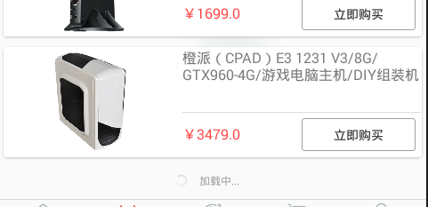

#RecyclerView & RecyclerView.Adapter封装

开始
===
在project的build.gradle添加如下代码(如下图)
```
allprojects {
    repositories {
        ...
        jcenter()
        maven { url "https://jitpack.io" }
    }
}
```

在build.gradle添加依赖
```
compile 'com.github.itcastsh:BaseRecyclerAndAdapter:0.1.2'
compile 'com.jakewharton:butterknife:8.4.0'
annotationProcessor 'com.jakewharton:butterknife-compiler:8.4.0'
```

##ItheimaRecyclerView使用方式

```
网格RecyclerView(app:spanCount="2")

    xmlns:app="http://schemas.android.com/apk/res-auto"
    <org.itheima.recycler.widget.ItheimaRecyclerView
        android:id="@+id/recyclerview"
        android:layout_width="match_parent"
        android:layout_height="match_parent"
        app:spanCount="2"/>
        
垂直滚动RecyclerView

    <org.itheima.recycler.widget.ItheimaRecyclerView
        android:id="@+id/recyclerview"
        android:layout_width="match_parent"
        android:layout_height="match_parent"/>
        
横向滚动RecyclerView（11:一行，12:二行.......）

    <org.itheima.recycler.widget.ItheimaRecyclerView
        android:id="@+id/recyclerview"
        android:layout_width="match_parent"
        android:layout_height="match_parent"
        app:spanCount="12"/>
```

##ItheimaRecyclerView添加头


```
<FrameLayout
    android:layout_width="match_parent"
    android:layout_height="match_parent">
    
    <org.itheima.recycler.widget.ItheimaRecyclerView
        android:id="@+id/recyclerview"
        android:layout_width="match_parent"
        android:layout_height="match_parent"/>
    
    <org.itheima.recycler.header.RecyclerViewHeader
        android:id="@+id/recycler_header"
        android:layout_width="match_parent"
        android:layout_height="180dp"
        android:layout_gravity="center_horizontal|top">
    
        <TextView
            android:layout_width="match_parent"
            android:layout_height="100dp"
            android:text="header"/>
    </org.itheima.recycler.header.RecyclerViewHeader>
</FrameLayout>


RecyclerViewHeader header = (RecyclerViewHeader) findViewById(R.id.header);
RecyclerView recyclerView = (RecyclerView) findViewById(R.id.recyclerview);
header.attachTo(recyclerView);
```

##ViewHolder模板（ViewHolder如果是内部类必须加上static和public关键字）

```
public static class MyRecyclerViewHolder extends BaseRecyclerViewHolder<DataBean> {
    //换成你布局文件中的id
    @BindView(R.id.tv_title)
    TextView tvTitle;

    public MyRecyclerViewHolder(ViewGroup parentView, int itemResId) {
        super(parentView, itemResId);
    }

    /**
     * 绑定数据的方法，在mData获取数据（mData声明在基类中）
     */
    @Override
    public void onBindRealData() {
        tvTitle.setText(mData.title);
    }


    /**
     * 给按钮添加点击事件（button改成你要添加点击事件的id）
     * @param v
     */
    @OnClick(R.id.button)
    public void click(CheckBox v) {
    }
}
```

##BaseRecyclerAdapter使用方式

```
adapter = new BaseRecyclerAdapter(recyclerView
        , MyRecyclerViewHolder.class
        , R.layout.item_reyclerview
        , datas);
        
@param recyclerView
@param viewHolderClazz
@param itemResId       recyclerView条目的资源id
@param datas           recyclerView展示的数据集合（可以传null）
```

##BaseLoadMoreRecyclerAdapter使用方式(加载跟多Adapter)



```
loadMoreAdapter = new BaseLoadMoreRecyclerAdapter(recyclerView
        , MyRecyclerViewHolder.class
        , R.layout.item_reyclerview
        , datas);
        

设置加载更多监听
    loadMoreAdapter.setPullAndMoreListener(new PullToMoreListener() {
        @Override
        public void onRefreshLoadMore(BaseLoadMoreRecyclerAdapter.LoadMoreViewHolder loadMoreViewHolder) {
            //加载更多数据
            ......
            loadMoreAdapter.addDatas(true,datas);
        }
    
        @Override
        public void onRefresh() {
            //暂时无用，下啦刷新
        }
    });

控制加状态
    loadMoreViewHolder.loading("加载中...");//默认文字："加载中..."
    loadMoreViewHolder.loadingFinish("没有更多数据");
    
```

##向Adapter中添加数据

```
@param isLoadMore 数据是否累加
@param datas      List数据

adapter.addDatas(true,datas);
```

##交流群
```
334700525
```